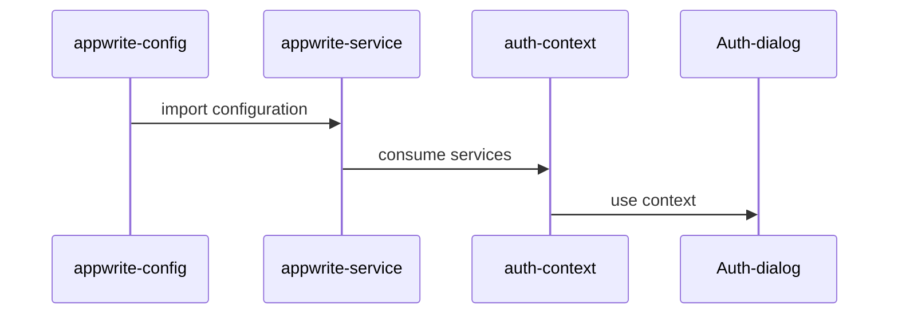
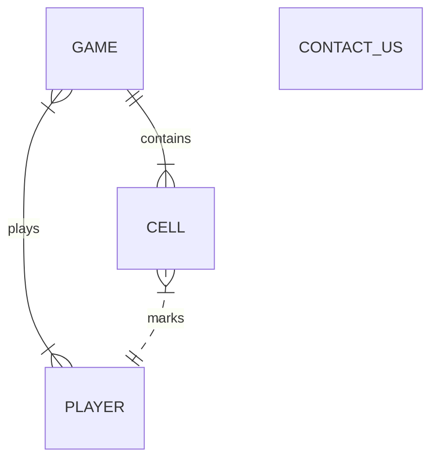

This is a [Next.js](https://nextjs.org) project bootstrapped with [`create-next-app`](https://nextjs.org/docs/app/api-reference/cli/create-next-app).

## Getting Started

First, install dependencies

```bash
npm i
```

Create and populate `.env.local` files:

```bash

```

Then run the development server:

```bash
npm run dev
# or
yarn dev
# or
pnpm dev
# or
bun dev
```

Open [http://localhost:3000](http://localhost:3000) with your browser to see the result.


### Appres

If running from `wsl` you may need to add the below to your `hosts` file.
```bash
echo "127.0.0.1 appwrite.localhost" | sudo tee -a /etc/hosts
```

### Appwrite integration



### Data Model
Defined in `/appres` directory and built in Appwrite.
